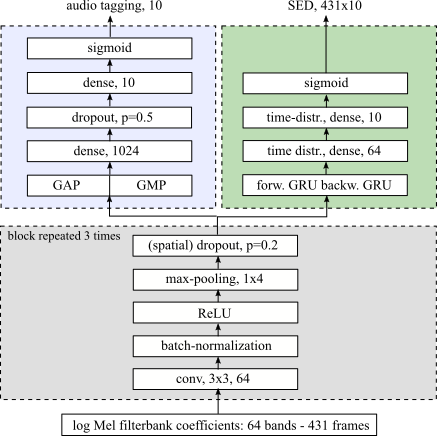
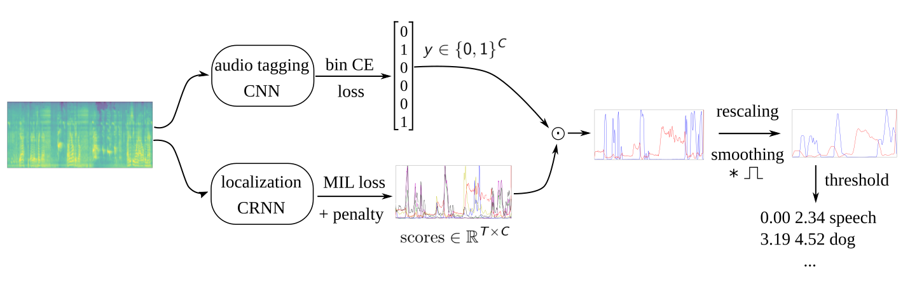
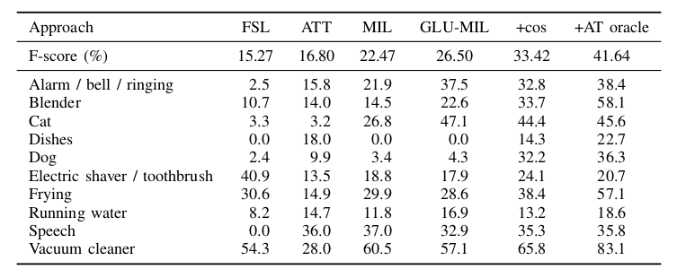

# ijcnn19_submission

Cosine-similarity penalty to discriminate sound classes in weakly-supervised sound event detection

If you use this code, please consider citing:

> Thomas Pellegrini, Léo Cances. Cosine-similarity penalty to discriminate sound classes in weakly-supervised sound event detection, arXiv preprint arXiv:1901.03146, 2019
> Preprint: https://arxiv.org/abs/1901.03146

This work is concerned with multi-label sound event detection when only weak labels are available for training. Weak annotations provide tags of audio events but do not provide temporal boundaries. 

The contributions are :

1. the use of a Multiple Instance Learning (MIL)-inspired loss function to perform sound event detection (SED),
2. the introduction of a cosine similarity penalty term to enhance the discriminative power of the network.

This lengthy (but structured:)) python3 notebook allows to train and test two Recurrent Convolutional Neural Networks (CRNN):

1. audio tagging (AT), i.e. multi-label classification at recording level, 

2. SED, i.e. localization of the event boundaries within the recordings.

This is a two-pass SED system: we first perform AT and then SED. 

For SED, we only keep the temporal predictions of the classes that were tagged by the AT system. 

Results on the DCASE 2018 task 4 data

Feel free to contact me for any question: thomas.pellegrini@irit.fr

Commenting the notebook is in my todo list!
