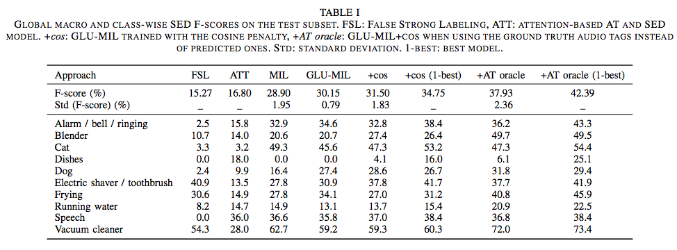

# ijcnn19_submission

Cosine-similarity penalty to discriminate sound classes in weakly-supervised sound event detection

This work is concerned with multi-label sound event detection when only weak labels are available for training. Weak annotations provide tags of audio events but do not provide temporal boundaries. 

The contributions are :

1. the use of a Multiple Instance Learning (MIL)-inspired loss function to perform sound event detection (SED),
2. the introduction of a cosine similarity penalty term to enhance the discriminative power of the network.

This lengthy (but structured:)) python3 notebook allows to train and test two Recurrent Convolutional Neural Networks (CRNN) in Keras with Tensorflow:

1. the first one for audio tagging (AT), i.e. multi-label classification at recording level, 

2. the second one for SED, i.e. localization of the event boundaries within the recordings.

There is code to replace the ReLU activation functions with Gated Linear Units (GLU) as was done in [1]

This is a two-pass SED system: we first perform AT and then SED. 

For SED, we only keep the temporal predictions of the classes that were tagged by the AT system. 

Results on the DCASE 2018 task 4 test subset data

Feel free to contact me for any question: thomas.pellegrini@irit.fr

If you use this code, please consider citing:

> Thomas Pellegrini, Léo Cances. Cosine-similarity penalty to discriminate sound classes in weakly-supervised sound event detection, arXiv preprint arXiv:1901.03146, 2019
> Preprint: https://arxiv.org/abs/1901.03146

Reference

[1] "Large-scale weakly supervised audio classification using gated convolutional neural network", in Proc. ICASSP2018 https://arxiv.org/abs/1710.00343, code: https://github.com/yongxuUSTC/dcase2017_task4_cvssp

